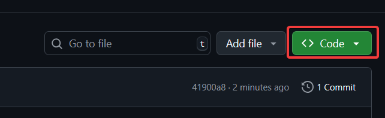

#  Starlight
A content mod for Balatro.

[List of additions](ADDITIONS.md)

## Installing
> **⚠️ This mod is NOT built with cross-mod compatibility in mind. Please do not open issues regarding incompatibilities with other mods.**

**If you haven't already, install [Steamodded](https://github.com/Steamodded/smods). [Windows installation guide](https://github.com/Steamodded/smods/wiki/Installing-Steamodded-windows), [macOS installation guide](https://github.com/Steamodded/smods/wiki/Installing-Steamodded-mac), [Linux installation guide](https://github.com/Steamodded/smods/wiki/Installing-Steamodded-linux)**
1. Download Starlight by clicking these 3 dots and then "Download ZIP".

2. Download the v0.4.1 release of CreditLib: [Direct download link](https://github.com/colonthreeing/CreditLib/releases/download/v0.4.1/CreditLib.zip).
3. Unzip both Starlight and CreditLib.
4. Move the extracted folders into the Mods folder. On Windows, this is `%AppData\Roaming\Balatro\Mods`.
5. Start the game, and it *should* work.

## Contributing
### Code
- Ensure readability at all times.
- A properly worded and colored in-game description for whatever you are making is not required, but please include a clear enough description either in-game or in the PR.
- Chance-based cards (i.e Bloodstone, Lucky Cards, etc.) must use SMODS's probability system, to ensure they synergize with Oops! All 6s. If you need to choose between 2+ things, use Lua's standard random functions.
- Try to keep it balanced. If you are unsure, create an issue with your idea and I'll try to help.

### Art
- Joker cards are 71 x 95, collectible cards are 63 x 93.
- Artwork for Astral cards is always a real constellation! Put the constellation into the empty space in the middle, and put the name of the constellation on the plate above.
- Legendary jokers are styled the same way as vanilla legendary jokers.
- Once you are done with creating the artwork, put it in the `assets/1x` folder. Then, create a new image twice the resolution, paste in whatever you were making, and scale it up 2x its size using nearest neighbour interpolation. Put the scaled image into `assets/2x`.
- Please use submit only `.psd` project files. This doesn't mean you only have to use Photoshop! Krita supports `.psd` out of the box, and paint.NET supports it with a plugin.
- Use layers. Please. For your own and others's sanities.
- Try to stay close to the Vanilla art style, but experimentation is always appreciated.
- Artwork is required to be in some way related to the name of whatever you're making
- See [ADDITIONS.md](ADDITIONS.md) for what needs artwork

### Ideas / Concepts
- Ideas for ***anything*** are appreciated!
- Try to keep it balanced.
- Try to keep ideas unique, while not making it too absurd.
- Be sure your idea's description is clear, preferably with an example use case as well.

## Credits & Thanks
- [Yahiamice's Yahimod](https://github.com/Yahiamice/yahimod-balatro) for being a great reference
- People in the Balatro Discord server for helping  